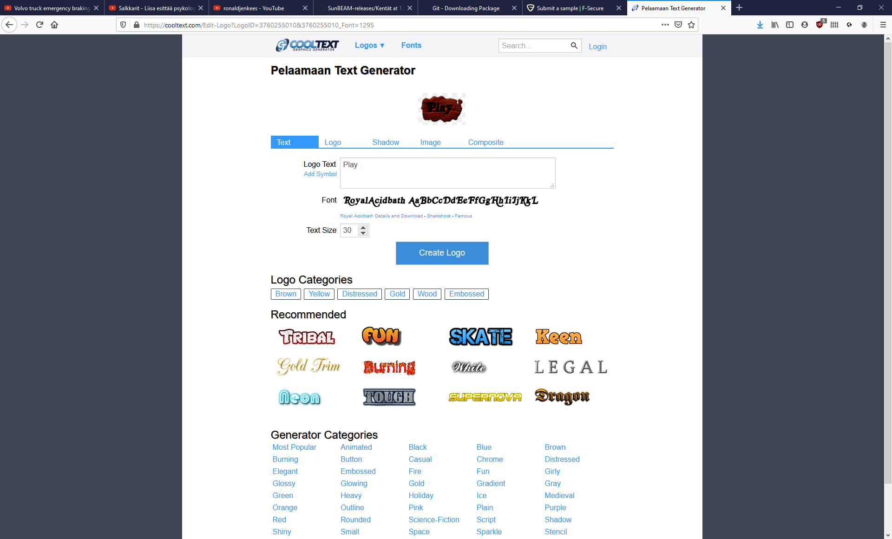

# Translating to English

This *wip-english-translation* git branch contains a folder named *English translation materials*. Currently the branch/folder only has some premade English main menu buttons and an instruction screenshot how to create new ones (see below).

## Ideas

 - Create separate language files so that text will be removed from the source code. File names will be like "Data\fi.yml" and "Data\en.yml". (Create a simple YAML parser for CoolBasic and publish it in [cbrepository.com](http://cbrepository.com) ). Contents of the files will be something like:
	For fi.yml:
	fi:
		Language: Suomi
		MainMenu:
			PlayButton: Play-fi.png
			Version: Versio {VERSION}
			...
			
	For en.yml:
	en:
		Language: English
		MainMenu:
			PlayButton: Play-en.png
			Version: Version {VERSION}
			...
			
- Variables in translation strings can be denoted with {VARIABLENAMEHERE}.

- Map names are currently in Finnish only. Make the application to do like this: If the map name text begins with two letters and a colon (e.g. fi: or en:) the string is considered to contain multiple languages. Another language begins when the text contains a space + two letters + a colon. If the map name does not contain the language prefix, assume it is Finnish. When saving a map, if the map name does not contain a language prefix, append the current language of the user interface as a prefix.

- Some maps contain text boxes with Finnish text. Like map names, do a similar translation possibility to text boxes too.

- In order to get *current* maps' texts (= map names and text boxes) translated, write a function that contains map related translations (these do not have to be in the YAML files) and updates all map files. This is for the reason that we do not want to replace users' existing map files (if they upgrade their game version) because the map files contain toplists that might get overwritten. This function gets run when a map is loaded, and the result of the function will only get saved if the map is saved - that is in two cases: if the user edits the map and saves it (rare), or if the user plays the map, solves it and writes their name to the toplist, in which case the game saves the map file to update the toplist. The function should only contain translation for currently existing maps. If new maps are added after the translation possibility has been created, the new maps should already contain both Finnish and English translations (if the maps are going to be added into this repository. User-made maps do not need to have two translations, so the UI does not need to enforce writing both Finnish and English texts).

- If a string cannot be found in one language, pick it from the other language. This is why the YAML files contain the language name as the root node, so that we can load multiple translations simultaneously and dynamically borrow stuff from another translation.

- When the game starts, if Asetukset.jtn file does not exist, or if it does not contain a *language* setting (if the file is from old game version), then ask the user "Select a language" in a popup window when the main menu appears. Also display a text "The lanague can be changed later in Settings (Asetukset)." Save the selected language to Asetukset.jtn immediately.

## CoolText.com

This folder contains some precreated buttons for the English main menu. These are created in [cooltext.com](https://cooltext.com). If you do need to create more buttons there, use the [Slab design](https://cooltext.com/Logo-Design-Slab) and the settings defined in this screenshot:

Also notice that you need to change the text color to black in the *Logo* tab (which is not open in the screenshot).